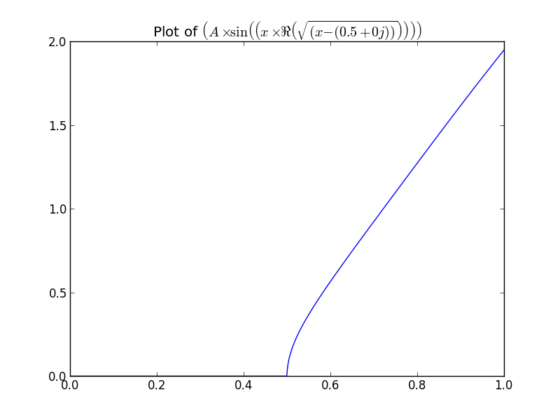
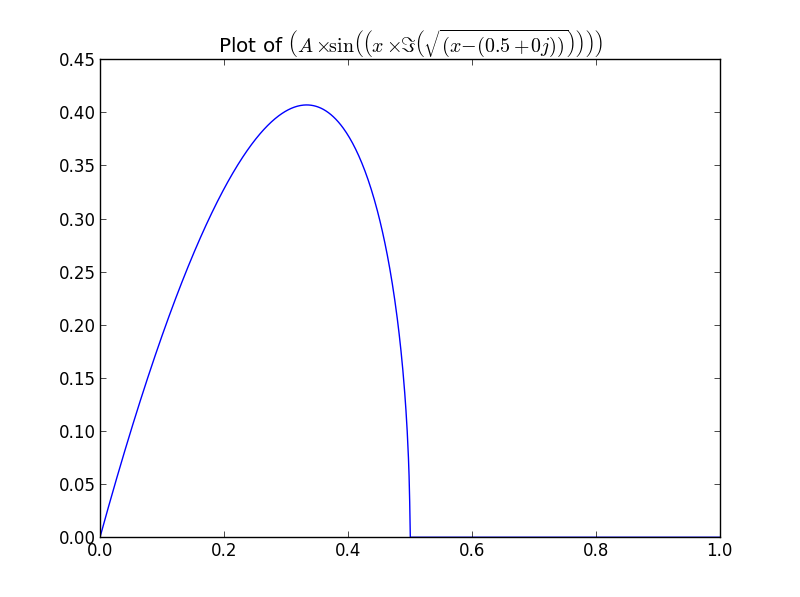

Examples
========
The following code demonstrates more advanced uses of the Equation Package

Dynamic Ploting of functions
----------------------------

Requires numpy, matplotlib and h5py

**sample/DPOF.py**

.. literalinclude:: ../../sample/DPOF.py
	:language: python

The Following is the result of running the script, given "dataset.hdf5" contains the attribute ``A = 3``
	
.. code-block:: none

	Enter Equation to Plot in terms of (x): A*sin(x*re(sqrt(x-(0.5+0j))))

.. code-block:: none

	Enter Equation to Plot in terms of (x): A*sin(x*im(sqrt(x-(0.5+0j))))

This sample asks the user for some function of ``x`` and then loads required data from a hdf5 file by search the file for 
variables in the function the user entered. Once the data has been retrived the function is plotted in the range :math:`[0,1]`
and the plot is titled using the display form of the function the user entered.

.. note:: It is important to search the hdf5 file for variables as hdf5 files may contain thousands of variables and take several Gigabytes of space.
